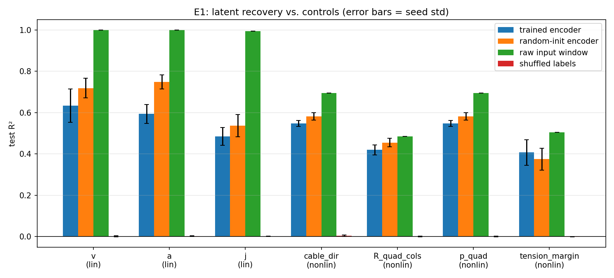
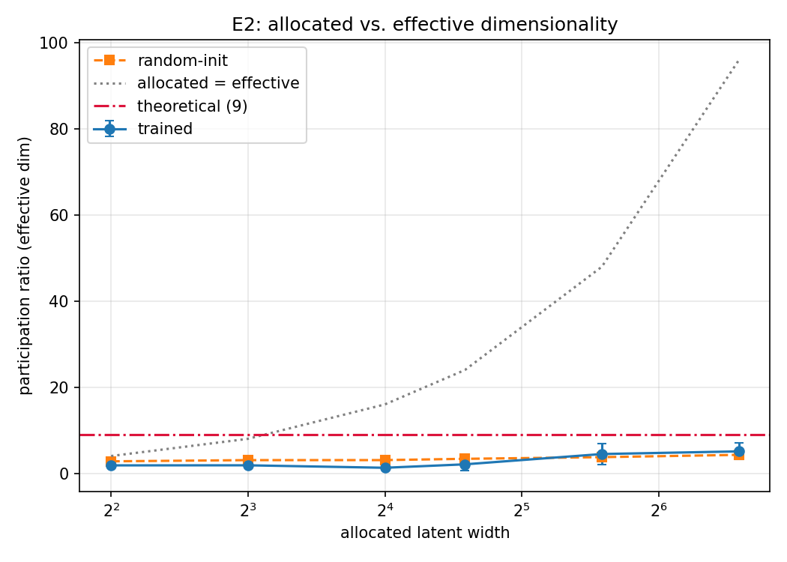
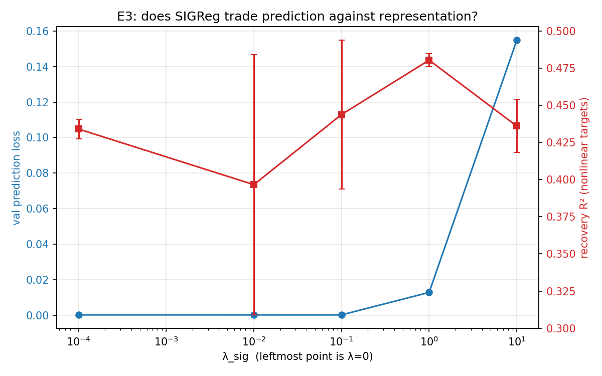

# Results

30 runs · seeds [0, 1, 2] · dataset `data/windows_v1`

### E1 — latent recovery (λ=1.0, width=24, 3 seeds)

| target | kind | trained encoder | random-init encoder | raw input window | shuffled labels | trained − random |
|---|---|---|---|---|---|---|
| `v` | linear_trivial | 0.634 ± 0.081 | 0.719 ± 0.048 | 1.000 ± 0.000 | 0.001 ± 0.003 | **-0.085** |
| `a` | linear_trivial | 0.593 ± 0.046 | 0.748 ± 0.034 | 1.000 ± 0.000 | 0.002 ± 0.002 | **-0.155** |
| `j` | linear_trivial | 0.485 ± 0.042 | 0.537 ± 0.054 | 0.994 ± 0.000 | 0.000 ± 0.001 | **-0.053** |
| `cable_dir` | nonlinear | 0.548 ± 0.015 | 0.581 ± 0.018 | 0.695 ± 0.000 | 0.004 ± 0.004 | **-0.034** |
| `R_quad_cols` | nonlinear | 0.420 ± 0.025 | 0.455 ± 0.021 | 0.485 ± 0.000 | 0.000 ± 0.002 | **-0.035** |
| `p_quad` | nonlinear | 0.548 ± 0.015 | 0.581 ± 0.018 | 0.695 ± 0.000 | -0.000 ± 0.002 | **-0.034** |
| `tension_margin` | nonlinear | 0.407 ± 0.061 | 0.375 ± 0.053 | 0.505 ± 0.000 | -0.002 ± 0.001 | **+0.032** |

### E2 — intrinsic dimensionality (λ=1.0)

| allocated | participation ratio | effective rank | 90% var | 99% var | random-init PR |
|---|---|---|---|---|---|
| 4 | 1.83 ± 0.26 | 2.11 ± 0.23 | 2.0 | 3.0 | 2.77 |
| 8 | 1.84 ± 0.08 | 1.99 ± 0.07 | 2.0 | 2.3 | 3.05 |
| 16 | 1.27 ± 0.20 | 1.44 ± 0.27 | 1.7 | 2.0 | 3.05 |
| 24 | 2.07 ± 1.50 | 2.79 ± 2.50 | 3.0 | 4.3 | 3.35 |
| 48 | 4.46 ± 2.44 | 5.75 ± 3.33 | 5.3 | 8.3 | 3.74 |
| 96 | 5.08 ± 1.89 | 6.79 ± 1.98 | 6.7 | 11.7 | 4.27 |

Theoretical minimal state dimension: **9**.

### E3 — SIGReg ablation (width=24)

| λ_sig | val pred loss | participation ratio | mean R² (nonlinear targets) | collapsed |
|---|---|---|---|---|
| 0.0 | 0.0001 ± 0.0000 | 4.97 ± 1.09 | 0.434 ± 0.007 | 0/3 |
| 0.01 | 0.0001 ± 0.0000 | 4.19 ± 1.23 | 0.397 ± 0.088 | 0/3 |
| 0.1 | 0.0001 ± 0.0000 | 4.30 ± 1.51 | 0.444 ± 0.050 | 0/3 |
| 1.0 | 0.0128 ± 0.0093 | 2.07 ± 1.50 | 0.480 ± 0.004 | 0/3 |
| 10.0 | 0.1548 ± 0.0242 | 2.06 ± 0.65 | 0.436 ± 0.018 | 0/3 |

λ minimising prediction loss: **0.1**
λ maximising nonlinear recovery: **1.0**
**Dissociation observed**: the objective and faithful state representation are optimised at different λ.

### Figures

---

# Interpretation

**Headline: E1 and E2 are negative results, and the controls are what make them credible.**
Nothing here should be read as "JEPA works on this system."

## E1 — the trained encoder does not beat an untrained one

On six of seven targets the trained encoder scores **below** a random-init encoder of identical
architecture, and the raw input window beats both on every target. F7 §1 states the stopping
condition explicitly: *if the trained encoder does not beat the random-init encoder, there is no
result*. That condition is met.

The single exception, `tension_margin` (+0.032 ± 0.06), is smaller than its own seed spread and is
not evidence of anything.

This is the failure mode the linear-decodability audit was built to expose. Had E1 been run as
originally designed — probing for `(p, v, a)`, the state the model is fed — it would have reported
R² ≈ 1.0 and looked like a triumph. The controls turn a spurious success into an interpretable
negative.

## E2 — effective dimensionality tracks allocation, not physics

The theoretical minimal state is 9. Measured participation ratio runs 1.27–5.08 and **increases
with allocated width** rather than converging on 9. Training also *reduces* effective
dimensionality relative to random init at every width up to 24 (e.g. 1.27 vs 3.05 at width 16).

So the latent is not finding the physically minimal representation. It is finding a *smaller* one,
which is consistent with E1: a representation that has discarded state information cannot linearly
expose the flat map's nonlinear consequences.

## E3 — a dissociation, and two surprises

The predicted dissociation appears: prediction loss is minimised at λ=0.1, nonlinear recovery at
λ=1.0. But two results contradict the design's premises outright.

**λ=0 does not collapse.** F5 §3 expected it to. Across three seeds it gives participation ratio
3.86–6.44 and the *lowest* prediction loss (1e-4). The degenerate constant-encoder solution exists
and is reachable in principle, but optimisation does not find it here.

**SIGReg induces the collapse it exists to prevent.** At λ=1.0, two of three seeds land at
participation ratio **1.01** — a one-dimensional latent — while λ=0 stays at 3.9–6.4. At λ=10 the
prediction loss degrades by three orders of magnitude (0.0001 → 0.1548).

### Mechanism check

Probing the regulariser directly with synthetic latents of known rank:

| input (24-dim) | SIGReg loss | participation ratio |
|---|---|---|
| isotropic Gaussian | 0.0003 | 23.85 |
| constant (total collapse) | 0.4089 | 0.00 |
| **rank-1 Gaussian** | **0.1668** | 1.00 |
| **rank-2 Gaussian** | **0.1257** | 1.89 |
| **rank-9 Gaussian** | **0.5148** | 6.45 |
| uniform, unit variance | 0.0003 | 23.86 |

The penalty is **not monotone in rank**: rank-9 is penalised more than rank-1. The test is
normality of random 1-D projections, and a low-rank Gaussian projects to a Gaussian along every
direction, so what the statistic actually responds to here is scale mismatch, not rank. It catches
the *constant* latent (0.4089) but not low-rank collapse.

That the unit-variance uniform scores identically to the Gaussian is expected rather than alarming:
random projections of any high-dimensional distribution are approximately Gaussian, so a sketched
test cannot distinguish them.

**This finding is about this implementation and configuration, not about SIGReg as published.**
Before it is claimed as a property of the method it must be checked against the reference
implementation ([rbalestr-lab/lejepa](https://github.com/rbalestr-lab/lejepa)) — in particular
whether embeddings are standardised before the projection test, which would remove the scale
confound. That check is the top open item.

## What would change these conclusions

- **Training length.** 60 epochs, one architecture. Prediction loss reaches 1e-4, so the objective
  is being optimised well — but "optimised well" and "learned a useful representation" are exactly
  what this project set out to distinguish, and they came apart here.
- **The SIGReg implementation**, per above.
- **Encoder capacity.** The TCN was inherited from SkyJEPA, where it was sized for 100 Hz embedded
  inference — a constraint that does not apply here (F5 §5).

## What is solid regardless

- The linear-decodability audit works and changed the experiment's design before it produced a
  misleading number.
- The controls work: without the random-init arm, E1's numbers (0.41–0.63 R²) would have looked
  like a positive result.
- The freeze assertion, the physical-units check, and the zero-variance-channel handling each
  caught a real bug.
